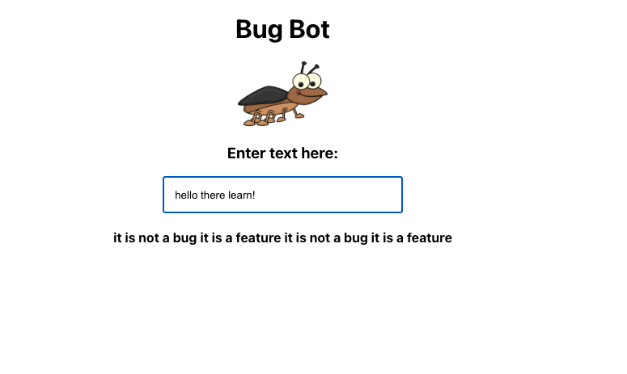

# Technical Interviews

### Ruby

Run the spec file with the command `rspec` followed by the file name. Create the code that makes the tests pass.

### JavaScript

Run the test file with the command `jest` followed by the file name. Create the code that makes the tests pass.

### React

Add the file dependencies using the command `yarn`. Fix the code so every character typed into the input field returns one word of the response.

